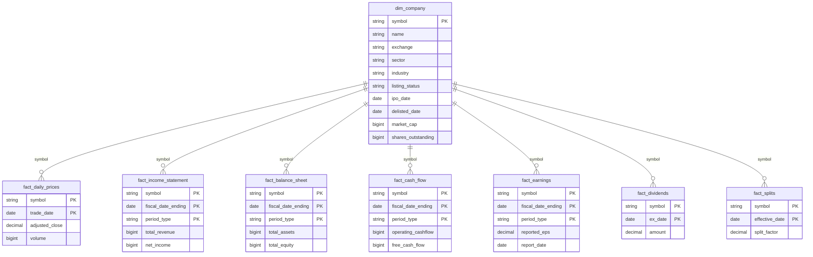
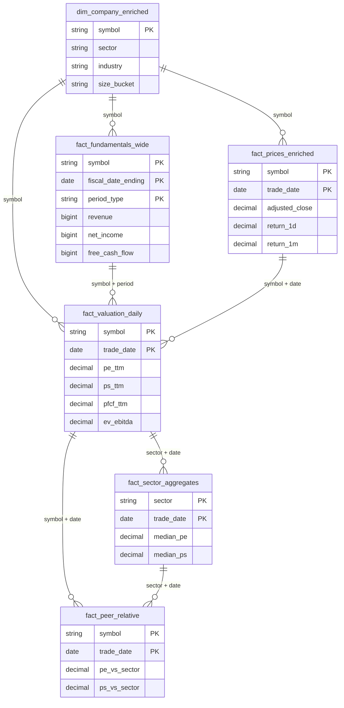

# Data Model

Entity-relationship view of the silver and gold tables. Authoritative column-level schemas live in [DATA_MODEL.md](../../DATA_MODEL.md); this page is for the relationships and grain at a glance.

## Silver layer

Cleaned, typed source data. One physical Parquet table (or partitioned set) per logical entity.

## Gold layer

Derived facts built by `transform_gold/*`. Recomputable; can be dropped and rebuilt.

> The ER diagrams above show *grain and keys only* — they are not exhaustive column lists. When schemas change, update [DATA_MODEL.md](../../DATA_MODEL.md) (authoritative) and refresh the keys here if the grain changed.
