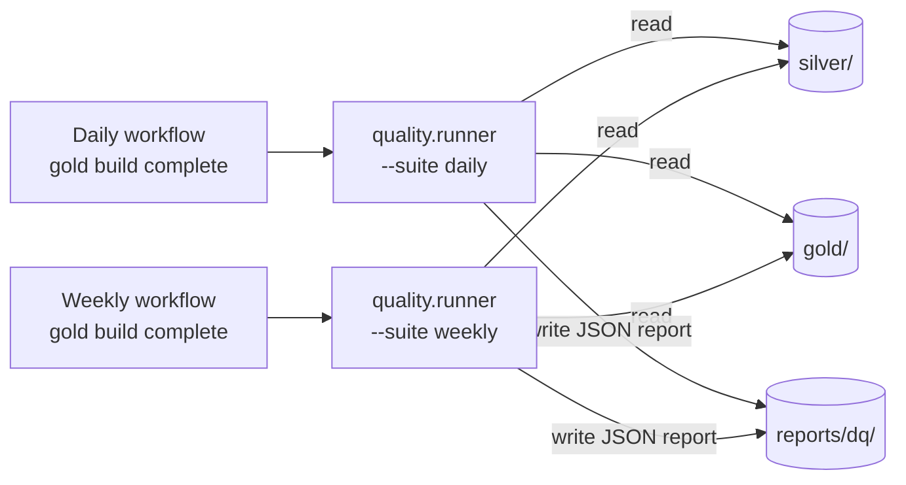

# Data Quality

Where DQ runs, what it checks, where reports land. Implementation lives in `quality/` (`runner.py`, `checks.py`); this page is the map.

## Where it runs

## Suite contents

> Fill this in as checks are added. Keep one row per check, ordered by severity.

| Suite  | Check ID | Layer  | What it asserts                                  | Severity | On fail        |
|--------|----------|--------|--------------------------------------------------|----------|----------------|
| daily  | _TBD_    | gold   | _e.g. fact_prices_enriched row count vs prior day_ | _block_  | _fail workflow_ |
| weekly | _TBD_    | silver | _e.g. no duplicate (symbol, fiscal_date_ending)_ | _block_  | _fail workflow_ |

## Severity model

- **block** — fails the GitHub Actions step; downstream steps don't run. Use for invariants (duplicate keys, schema drift).
- **warn** — logged in the report but does not fail the workflow. Use for soft signals (row count drift, freshness within a tolerance).

## Where to look when something fails

1. The failing workflow step's log (search for `quality.runner`).
2. The latest JSON report under `reports/dq/`.
3. The check definition in `quality/checks.py`.
4. The table itself via a DuckDB notebook against R2.
