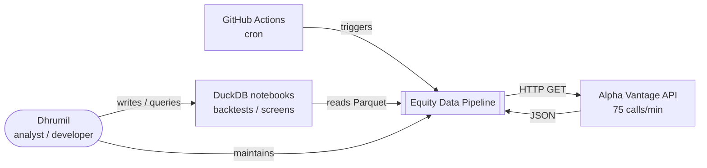
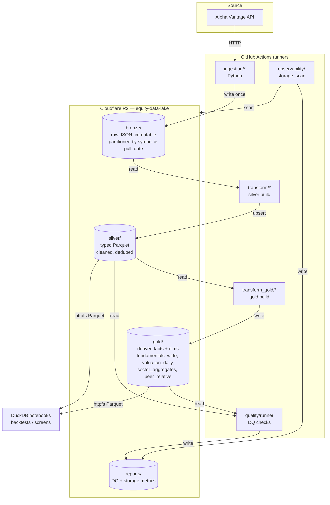

# System Overview

High-level view of the equity data pipeline. For schemas see [data-model.md](data-model.md); for job order see [pipeline-dag.md](pipeline-dag.md).

## C4 Level 1 — Context

Who and what interacts with the system.

## C4 Level 2 — Containers / Layers

The bronze → silver → gold lakehouse pattern, all backed by Cloudflare R2.

## Design principles (one-liners)

1. **Bronze is immutable.** Raw API payloads are never rewritten. See [PROJECT_BRIEF.md](../../PROJECT_BRIEF.md).
2. **Silver is the analytical source of truth for source data.** Typed, deduped, no string `"None"`. No derived metrics (one exception: `free_cash_flow`).
3. **Gold holds derived facts.** Ratios, returns, peer/sector comparisons. Recomputable from silver.
4. **Idempotency everywhere.** Every job is safe to re-run; transforms upsert on a documented key.
5. **Rate-limit shared.** All API calls flow through `ingestion/utils/rate_limiter.py`.
6. **Universe by config.** Scope of work driven by `config/ticker_universe.csv`, not code.
