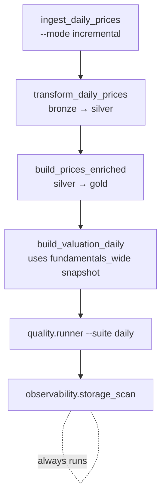
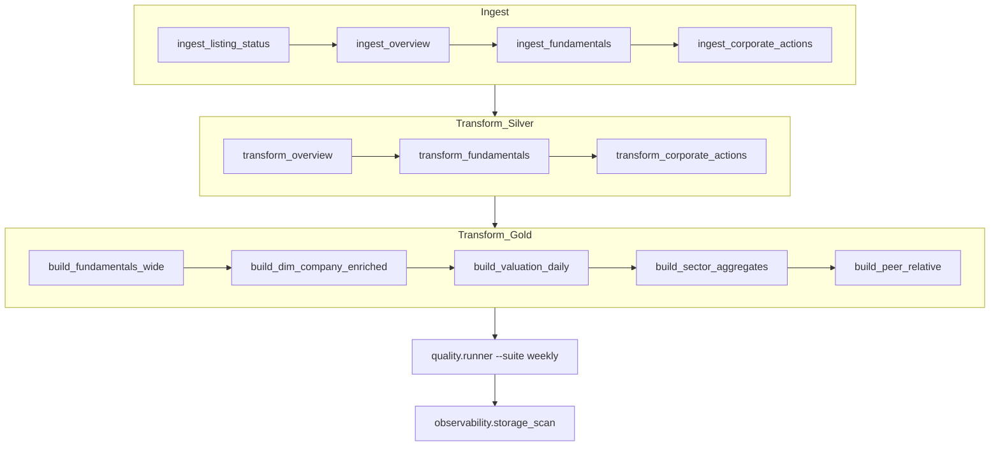

# Pipeline DAG

Job dependencies for the two GitHub Actions workflows. Source of truth is `.github/workflows/*.yml`; this diagram should be updated whenever a workflow step is added, removed, or reordered.

## Daily workflow

Trigger: cron `0 23 * * 1-5` (6pm ET, weekdays) — see [daily_prices.yml](../../.github/workflows/daily_prices.yml).

Notes:
- `build_valuation_daily` depends on `gold/fact_fundamentals_wide`, which is refreshed in the **weekly** run. The daily run reads whichever snapshot is current.
- `storage_scan` runs with `if: always()` so we still get metrics on a failed pipeline.

## Weekly workflow

Trigger: cron `0 6 * * 0` (Sunday 06:00 UTC) — see [weekly_refresh.yml](../../.github/workflows/weekly_refresh.yml).

Notes:
- Gold ordering is load-bearing — comments in [weekly_refresh.yml](../../.github/workflows/weekly_refresh.yml) explain why each step reads from the prior one.
- Ingest steps are sequential today (single runner, shared rate limiter). If we ever shard tickers, this is where the diagram changes first.
